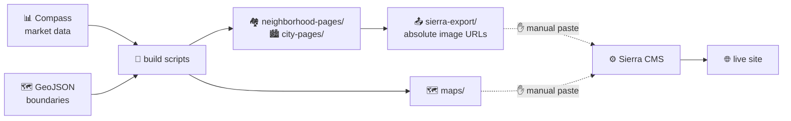
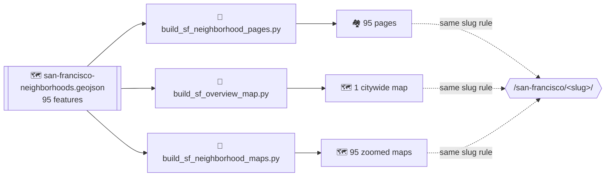
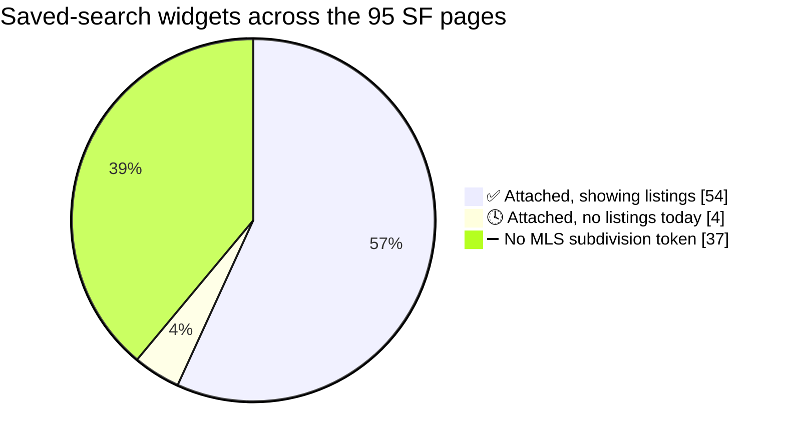
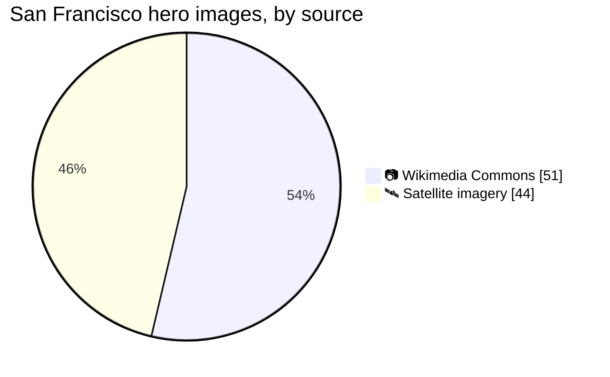

# 🏡 The Chen Team — Peninsula & Bay Area Pages

<!-- BADGES:BEGIN -->

[](https://github.com/jtcompass212/TheChenTeam/actions/workflows/project-status.yml)


<!-- BADGES:END -->

Static HTML for The Chen Team's Sierra Interactive site: city pages,
neighborhood pages, and interactive Leaflet neighborhood maps.

Everything here is plain HTML with figures hardcoded at build time — no
scripts, no runtime data fetching. Paste-ready output lives in
`sierra-export/`.

### 🚚 How a page reaches the site



Every solid arrow is automated and checked. **The two dotted arrows are hand
work** — publication is a manual paste, one page at a time, into Sierra's
TinyMCE source view (see `sierra-export/README.md`). Nothing in this repo
pushes to the site or reads back from it, so **what is actually live is not
recorded here.** Do not infer it from this file. Counts below describe what the
repo contains, not what has been published.

The one exception is [Sierra: what is configured in the CMS](#sierra-cms),
a hand-written, dated snapshot of settings that exist only in the admin. It is
not generated and not checked, and it goes stale on its own.

## 📁 Contents

<!-- CONTENTS:BEGIN -->

| | Directory | What's in it |
|:-:|---|---|
| 🏙️ | `city-pages/` | 27 city pages |
| 🏘️ | `neighborhood-pages/` | 219 neighborhood pages across 10 cities |
| 🗺️ | `maps/` | Leaflet map widgets for 10 cities, plus unwritten page scaffolds |
| 📤 | `sierra-export/` | 246 paste-ready files with absolute image URLs |
| 📸 | `city-images/` | Hero photos, plus `sourced/` for freely-licensed images |
| 📊 | `data/market/` | Compass market data behind the pages, and how to refresh it |
| 📝 | `docs/` | Photo shot list and design specs |
| 🔧 | `scripts/` | Build and refresh tooling |

<!-- CONTENTS:END -->

Two further neighborhood datasets sit at the repo root in a different format,
covering a wider area than the hand-drawn city maps:

- `san-francisco-neighborhoods.{geojson,html}` — 95 neighborhoods
- `south-san-francisco-neighborhoods.{geojson,html}` — 16 neighborhoods

The San Francisco `.geojson` is the source of truth for that city — see
[🌉 San Francisco](#san-francisco). The `.html` beside it is the original upload
and is **not the widget used on the site**: it is a standalone viewer with no
links out of it, keyed on Compass `seo_id` names rather than page slugs, and it
loads Leaflet from unpkg. The generated overview map is what gets published.

<!-- STATUS:BEGIN -->

<a id="work-remaining"></a>

## 🚧 Work remaining

Market data is complete: all **246 pages in this repo** carry verified Compass figures. What is left falls into three piles.

| | | Count | |
|:-:|---|---:|---|
| ✅ | Neighborhoods with no page | **0** | blank scaffolds in `maps/`, prose included |
| ✅ | Empty photo slots | **0** | of 354 total; 354 filled so far |

### 🗺️ Neighborhood page coverage

219 neighborhoods are mapped; 219 have a written page.

| City | Written | Mapped | Remaining | Share of the repo |
|---|---:|---:|---:|---|
| Belmont | 9 | 9 | — | `█▉` |
| Burlingame | 13 | 13 | — | `██▊` |
| Foster City | 10 | 10 | — | `██▏` |
| Hillsborough | 15 | 15 | — | `███▏` |
| Millbrae | 13 | 13 | — | `██▊` |
| Redwood City | 13 | 13 | — | `██▊` |
| San Bruno | 17 | 17 | — | `███▋` |
| San Carlos | 6 | 6 | — | `█▎` |
| San Francisco | 95 | 95 | — | `████████████████████` |
| San Mateo | 28 | 28 | — | `█████▉` |
| **Total** | **219** | **219** | **0** | |

Scaffolds are templates, not publishable pages — every slot still reads `[ PLACEHOLDER ]`. **Publish from `neighborhood-pages/` or `sierra-export/`, never from `maps/`.**

Two of the remaining entries are not residential neighborhoods — **Golden Gate National Cemetery** (San Bruno) and **Tanforan** (San Bruno). Green Hills Country Club was the same case and is handled by saying so on the page rather than inventing a median; these deserve the same decision before anyone writes them.

### 📸 Photography

Every image slot is filled — 354 of them, none still rendering a placeholder. See [Photos](#photos) for where they came from.

| Area | Empty slots |
|---|---:|
| **Total** | **0** |

> **The shot list is out of date.** It briefs 135 slots against an actual 0 — it predates the newer city directories. Regenerate with `python3 scripts/write_shot_list.py`.

### 🤔 Calls that need you

None of these block anything. Each is a judgment about the business or the market.

| Item | Scope | What's needed |
|---|---|---|
| **Shoreview's +38.6%** | 1 page | Clears the 8-sale threshold honestly on 13 sales, but it is the largest swing published anywhere on the site. |
| **"Highlands" identity** | 1 page | Compass lists it separately from San Mateo Highlands so the match to Millbrae Highlands is probable, but the API cannot confirm which city a neighborhood belongs to. |
| **Mills Estates, twice** | 2 pages | One Compass neighborhood straddling the Millbrae–Burlingame line, so both pages publish identical figures. Correct, but deliberate. |
| **Image hosting** | 383 images | Served via jsDelivr off this public repo, pinned to `@main` — so the repo must stay public and the live site follows whatever main holds. Rebuild with `--image-base` against Sierra's media library to drop the GitHub dependency. |
| **Icon hosting** | 781 icon URLs | Tabler icons load from jsDelivr at `@latest`, an unpinned version this repo does not control. They are absolute URLs in the page source, so `--image-base` cannot move them. |
| **Hillsborough boundary feature** | 1 geojson | A 95-vertex polygon named `Hillsborough` sits in the neighborhood layer, larger than any real neighborhood — almost certainly a city outline that got mixed in. |

### 🚫 Pages that publish no market figures — on purpose

Each states its reason on the page rather than borrowing a citywide median.

| Page | Reason |
|---|---|
| `burlingame/ingoldmilldale` | No sales attributed to it in the MLS |
| `foster-city/vintage-park` | Not a residential area |
| `hillsborough/parrot-drive-area` | Too few sales a year to support a median |
| `millbrae/green-hills` | Too few sales a year to support a median |
| `millbrae/green-hills-country-club` | Not a residential area |
| `redwood-city/downtown-redwood-city` | No sales attributed to it in the MLS |
| `redwood-city/bair-island` | Not a residential area |
| `san-bruno/belle-air-north` | No sales attributed to it in the MLS |
| `san-bruno/downtown-san-bruno` | No sales attributed to it in the MLS |
| `san-bruno/bayhill` | Not a residential area |
| `san-bruno/tanforan` | Not a residential area |
| `san-bruno/golden-gate-national-cemetery` | Not a residential area |
| `san-francisco/forest-knolls` | Too few sales a year to support a median |
| `san-francisco/merced-manor` | Too few sales a year to support a median |
| `san-francisco/clarendon-heights` | Too few sales a year to support a median |
| `san-francisco/haight-ashbury` | Too few sales a year to support a median |
| `san-francisco/little-hollywood` | Too few sales a year to support a median |
| `san-francisco/south-of-market` | Too few sales a year to support a median |
| `san-francisco/westwood-highlands` | Too few sales a year to support a median |
| `san-francisco/anza-vista` | Too few sales a year to support a median |
| `san-francisco/stonestown` | Too few sales a year to support a median |
| `san-francisco/lake-merced-park` | Too few sales a year to support a median |
| `san-francisco/presidio` | Not a residential area |
| `san-francisco/golden-gate-park` | Not a residential area |
| `san-francisco/lincoln-park` | Not a residential area |
| `san-francisco/union-square` | Not a residential area |
| `san-francisco/bayview-heights` | No sales attributed to it in the MLS |
| `san-francisco/sherwood-forest` | No sales attributed to it in the MLS |
| `san-francisco/lower-nob-hill` | No sales attributed to it in the MLS |
| `san-mateo/lauriedale` | Too few sales a year to support a median |
| `san-mateo/hillsdale-the-lanes` | No separate Compass reporting area for it |

<!-- STATUS:END -->

## 🏙️ City pages (27)

aptos · atherton · belmont · brisbane · burlingame · cupertino · foster-city ·
fremont · gilroy · hillsborough · mill-valley · millbrae · mountain-view ·
newark · oakland · pacifica · palo-alto · redwood-city · san-bruno ·
san-carlos · san-francisco · san-jose · san-mateo · san-rafael ·
south-san-francisco · sunnyvale · woodside

Each carries a market snapshot, a quarterly price chart, neighborhood cards
and a schools/history block. Market figures come from Compass Market Insights
— see `data/market/README.md`.

City pages no longer carry a team-production stat block. It shipped with sample
figures and a `// Replace with your verified production figures` comment still
in the source, so it was removed from all 27 rather than published unverified.
Anything replacing it needs real numbers first.

## 🏘️ Neighborhood pages (219)

| City | Pages | Mapped neighborhoods |
|---|---|---|
| San Francisco | 95 | 95 |
| San Mateo | 28 | 28 |
| San Bruno | 17 | 17 |
| Hillsborough | 15 | 15 |
| Burlingame | 13 | 13 |
| Millbrae | 13 | 13 |
| Redwood City | 13 | 13 |
| Foster City | 10 | 10 |
| Belmont | 9 | 9 |
| San Carlos | 6 | 6 |

Every mapped neighborhood has a written page.

San Francisco is built by its own scripts from a citywide GeoJSON rather than
hand-drawn per neighborhood — see [🌉 San Francisco](#san-francisco).

`maps/<city>/<neighborhood>.html` holds an unwritten scaffold for every
neighborhood that has no page yet. See [Work remaining](#work-remaining) for
the current counts, which cities are outstanding, and which pages deliberately
publish no market figures.

<a id="san-francisco"></a>

## 🌉 San Francisco

San Francisco arrived after the Peninsula cities and is built differently. The
other nine cities have hand-drawn geometry per neighborhood; San Francisco is
generated end to end from one citywide dataset.

`san-francisco-neighborhoods.geojson` at the repo root — 95 features — is the
source of truth for names, boundaries and slugs. Three scripts read it:



```
python3 scripts/build_sf_neighborhood_pages.py   # neighborhood-pages/san-francisco/
python3 scripts/build_sf_overview_map.py         # the clickable citywide map
python3 scripts/build_sf_neighborhood_maps.py    # one zoomed map per neighborhood
```

⚠️ All three slugify names the same way, so every polygon links to a page that
exists, at `/san-francisco/<slug>/`. **Change the slug rule in one script and you
must change it in all three** — otherwise the maps point at pages that 404.

**The overview map** is written to
`maps/san-francisco/map/san-francisco-overview-map.html`: 95 polygons, each
linking to its own page.

**Per-neighborhood maps** are written to `maps/san-francisco/<slug>-map.html`,
95 of them — the neighborhood filled and outlined in gold, its neighbors grey
and clickable. Neighbours are computed rather than curated: two neighborhoods
are neighbors when their outlines come within 30 m of each other. Exact shared
vertices alone are not enough, because the source is not a clean tessellation.
The primary feature is written **last** so Leaflet paints it on top, which keeps
its border unbroken along every shared edge.

`maps/san-francisco/map/san-francisco-district-map.html` is a leftover from the
removed district pages. Nothing references it.

### 🔑 The CARTO basemap key

Every map in this repo draws CARTO Voyager tiles, which have required an API key
since August 2026 — without one, each tile renders the words "API KEY REQUIRED".

The key lives in `data/carto-basemap-key.txt` and is stamped into the map files
rather than typed into each one:

```
python3 scripts/set_carto_key.py           # stamp it across maps/
python3 scripts/set_carto_key.py --check   # verify none are missing or stale
```

239 map files currently carry it. It is a client-side basemap key — it ships in
the page source by design, which is why it is committed here. That also means
it should be **domain-restricted in the CARTO dashboard**, which has not been
done yet.

## 🗺️ Maps: neighborhoods by city (219 total)

Alphabetized per city; names match what each map renders. Entries marked
_(hidden)_ carry `"hidden": true` and render dimmed.

> **Note:** `maps/hillsborough/map/hillsborough-map.geojson` also contains a
> feature named `Hillsborough` that is not a neighborhood — a 95-vertex
> MultiPolygon larger than any neighborhood in the file, which looks like a
> city-boundary outline sitting in the neighborhood layer. It is excluded
> from the count below.

### Belmont (9)

- Belmont Country Club
- Belmont Heights
- Cipriani
- Downtown Belmont
- Homeview
- McDougal
- Plateau-Skymont
- Sterling Downs
- Western Hills

### Burlingame (13)

- Burlingables _(hidden)_
- Burlingame Gardens
- Burlingame Grove
- Burlingame Hills
- Burlingame Park
- Burlingame Terrace
- Burlingame Village
- Downtown Burlingame
- Easton Addition
- Ingoldmilldale
- Lyon Hoag
- Mills Estates
- Ray Park

### Foster City (10)

- Bay Vista
- Carmel Village
- Dolphin Bay
- Harbor Side
- Isle Cove
- Marina Point
- Sea Colony
- The Islands
- Treasure Isle
- Vintage Park

### Hillsborough (15)

- Brewer Subdivision
- Burlingame Hills
- Carolands
- Country Club Manor
- Hillsborough Heights
- Hillsborough Hills
- Hillsborough Knolls
- Hillsborough Oaks
- Hillsborough Park
- Homeplace
- Lakeview
- Parrot Drive Area
- Ryan Tract
- Skyfarm
- Tobin Clark Estate

### Millbrae (13)

- Bayside Manor
- Capuchino Village
- Downtown Millbrae
- Glenview Highlands
- Green Hills
- Green Hills Country Club
- Highlands
- Lomita Hills
- Meadow Glen
- Millbrae Meadows
- Mills Estates
- Millwood
- Telescope Hills

### Redwood City (13)

- Bair Island
- Centennial
- Central Park
- Clifford Heights
- Cordilleras Heights
- Downtown Redwood City
- Dumbarton
- Eagle Hill
- Edgewood Park
- Farm Hills Estates
- Horgan Ranch
- Mt. Carmel
- Redwood Shores

### San Bruno (17)

- Bayhill
- Belle Air North
- Belle Air Park
- Capuchino
- Crestmoor
- Downtown San Bruno
- Golden Gate National Cemetery
- Huntington Park
- Lomita Park
- Mills Park
- Monte Verde
- Pacific Heights
- Portola Highlands
- Rollingwood
- San Bruno Park
- Shelter Creek
- Tanforan

### San Carlos (6)

- Alder Manor
- Beverly Terrace
- Clearfield Park
- Cordes
- El Sereno Corte
- Howard Park

### San Francisco (95)

- Alamo Square
- Anza Vista
- Balboa Terrace
- Bayview
- Bayview Heights
- Bernal Heights
- Buena Vista
- Candlestick Point
- Central Richmond
- Central Sunset
- Central Waterfront-Dogpatch
- Civic Center
- Clarendon Heights
- Cole Valley/Parnassus Heights
- Corona Heights
- Cow Hollow
- Crocker Amazon
- Diamond Heights
- Duboce Triangle
- Eureka Valley-Dolores Heights
- Excelsior
- Financial District-Barbary Coast
- Forest Hill
- Forest Hill Extension
- Forest Knolls
- Glen Park
- Golden Gate Heights
- Golden Gate Park
- Haight Ashbury
- Hayes Valley
- Hunters Point
- Ingleside
- Ingleside Heights
- Ingleside Terraces
- Inner Parkside
- Inner Richmond
- Inner Sunset
- Jordan Park-Laurel Heights
- Lake Merced Park
- Lake Street
- Lakeshore
- Lakeside
- Lincoln Park
- Little Hollywood
- Lone Mountain
- Lower Nob Hill
- Lower Pacific Heights
- Marina District
- Merced Heights
- Merced Manor
- Midtown Terrace
- Miraloma Park
- Mission Bay
- Mission District
- Mission Dolores
- Mission Terrace
- Monterey Heights
- Mount Davidson Manor
- Nob Hill
- Noe Valley
- North Beach
- North Panhandle
- North Waterfront
- Oceanview
- Outer Mission
- Outer Parkside
- Outer Richmond
- Outer Sunset
- Pacific Heights
- Panhandle
- Parkside
- Pinelake Park
- Portola
- Potrero Hill
- Presidio
- Presidio Heights
- Russian Hill
- Saint Francis Wood
- Sea Cliff
- Sherwood Forest
- Silver Terrace
- South Beach
- South of Market
- Stonestown
- Sunnyside
- Telegraph Hill
- Tenderloin
- Twin Peaks
- Union Square
- Visitacion Valley
- West Portal
- Western Addition
- Westwood Highlands
- Westwood Park
- Yerba Buena

### San Mateo (28)

- Aragon
- Baywood
- Baywood Knolls
- Baywood Park
- Beresford Manor
- Bowie Estate
- Eastern Addition
- Fiesta Gardens
- Foothill Terrace
- Harbor Town
- Hayward Park
- Hillsdale "The Lanes"
- Homestead
- Lakeshore
- Laurelwood & sugarloaf
- Lauriedale
- Los Prados
- North Shoreview
- Parkside
- San Mateo Highlands
- San Mateo Knolls
- San Mateo Park
- San Mateo Terrace/Beresford
- San Mateo Village
- San Mateo Woods/Bayridge
- Shoreview
- Sunnybrae
- Westwood Knolls

<a id="sierra-cms"></a>

## ⚙️ Sierra: what is configured in the CMS

> **A dated snapshot, not a live mirror.** Everything else in this file is read
> from the working tree; this section is not, and nothing regenerates or checks
> it. It records Sierra-side configuration that does not exist anywhere in this
> repo — page components, saved searches, URL structure — because otherwise it
> is only discoverable by clicking through the admin. **Last verified 2026-08-31.**
> Treat it as a starting point and confirm in the admin before relying on it.

**URLs are exactly two levels.** A Sierra content page lives at
`/{section}/{page}/` and nothing deeper is possible, so
`/san-francisco/{district}/{neighborhood}` cannot be built. San Francisco pages
are therefore flat: `/san-francisco/<neighborhood>/`. Page filenames accept only
`a-z`, `0-9` and `-`; a slash typed into the field is silently stripped rather
than rejected, which fails quietly.

**Maps must be Shared HTML Widgets.** The inline TinyMCE page editor strips
`<script>` tags, so pasting a map into the page body loses the Leaflet code and
leaves a dead container. Add maps under Content → Manage Shared HTML Widgets and
attach them as a page component instead. 230 of the 239 files in `maps/` carry a
comment saying so at the top; the nine that do not are the older per-city
overview maps under `maps/<city>/map/`, which predate the note.

**San Francisco page components.** All 95 pages carry their neighborhood map.
58 of them also carry a "Listings from Saved Search" component below the map,
titled `Homes for Sale in <Name>`, backed by a saved search named
`<Name> (San Francisco)` — property type All Types, filtered to that
neighborhood's exact MLS Subdivision token.



| | Count | |
|:-:|---:|---|
| 🗺️ | **95 / 95** | pages carry their neighborhood map |
| ✅ | **58 / 95** | pages carry a saved-search widget |
| ➖ | **37** | have no MLS Subdivision token, so nothing was attached |

The 37 are not an oversight. The MLS has no Subdivision token for them, and a
prefix or district match would pull in the wrong listings — so nothing was
attached rather than something inaccurate.

🕓 Four of the 58 render "No Matching Listings" rather than a title, because
their saved search returns zero active listings today — **Balboa Terrace,
Monterey Heights, Presidio Heights, Westwood Park**. They are correctly
configured and will populate on their own when inventory appears.

> ⚠️ **A live page is therefore not a reliable test of whether the widget is
> attached.** An empty saved search looks identical to a missing component.
> Check the admin, not the site.

**Page IDs are sequential by creation order**, which was alphabetical:
`id = 345998 + alphabetical_index` across the 95 neighborhoods, with Noe Valley
displaced out of sequence (it was created first) and everything after it shifted
by one. That reproduced all 30 IDs confirmed by hand and is how the rest were
derived — but it is an observation, not a guarantee. Verify the page title after
loading an ID before writing to it.

## 🔄 Refreshing market data

Figures are pulled from Compass Market Insights and written into the pages by
script, so an update is a re-scrape plus a re-run rather than hand-editing
dozens of files:

```
python3 scripts/apply_market_data.py       # neighborhood pages
python3 scripts/apply_city_market_data.py  # city pages
python3 scripts/build_sierra.py            # regenerate sierra-export/
python3 scripts/update_readme_status.py    # refresh "Work remaining" above
```

Run the last one after anything that changes page counts. Every number in the
[Work remaining](#work-remaining) section is read from the working tree, so it
cannot drift the way hand-typed counts did.

## ✅ Keeping the project status honest

Two things guard it, so nobody has to remember.

**A pre-push hook.** Enable it once per clone:

```
git config core.hooksPath .githooks
```

From then on, `git push` regenerates the status block if it is stale and stops
so you can commit it, then runs the page checks. `git push --no-verify` skips
it when you genuinely need to.

**CI.** `.github/workflows/project-status.yml` runs the same checks on every
push to `main` and every pull request. The hook is opt-in per clone, so this is
the backstop that covers everyone — including edits made through the GitHub web
interface.

Both call the same two scripts, which you can also run by hand:

```
python3 scripts/update_readme_status.py --check   # is the backlog current?
python3 scripts/verify_repo.py                    # do the pages hold together?
```

`verify_repo.py` checks what has actually broken here before: figures drifting
from the dataset they cite, placeholder text reaching a publishable page, a
stale scaffold in `maps/` shadowing a written page, markup left unbalanced by a
bad substitution, and export URLs that look absolute but contain a traversal
and 404 on paste.

`data/market/README.md` documents the Compass API contract, the metric codes,
and the rules governing which figures publish — including the sale-count
thresholds that decide when a year-over-year change is withheld.

<a id="photos"></a>

## 📸 Photos

✅ All 354 image slots are filled — no page still renders `[ HERO IMAGE ]`. They
come from two trees:

| | Tree | Files | What they are |
|:-:|---|---:|---|
| 🏙️ | `city-images/sourced/` | 135 | Freely-licensed city photos, credited on the page |
| 🏘️ | `neighborhood-images/` | 219 | One hero per neighborhood page |

The 95 San Francisco heroes were sourced in bulk by
`scripts/build_sf_hero_images.py` and `scripts/finalize_sf_hero_images.py`, and
what each one ended up being is recorded in `data/sf-hero-image-final-log.json`:



⚠️ The satellite ones are a deliberate fallback for neighborhoods with no usable
archive photo — they are stand-ins, not photography, and are the obvious
candidates if original shots are ever commissioned.

`docs/photo-shot-list.md` is stale: it still briefs 135 empty slots against an
actual 0. Regenerate it with `python3 scripts/write_shot_list.py`.

> **Image containers must set `height`, not `min-height`.** A percentage height
> on a child resolves against the parent's *specified* `height`; `min-height`
> leaves that as `auto`, the child collapses, and `object-fit: cover` letterboxes
> the photo instead of filling the frame. This had letterboxed images on all 246
> pages. If a hero renders with bars around it, check that rule first.
